# example.md — Hardening end-to-end con il menu (screenshot reali)

Walkthrough **completo e reale**: da una Ubuntu 22.04 appena installata (nginx +
PHP-FPM presenti ma **non** hardenizzati) fino a un sito PHP isolato in **AppArmor
enforce**, il tutto guidato dal menu `harden-menu.sh`. Include un capitolo di
**modifica di un sito già configurato** (aggiunta di un path scrivibile, divieto
granulare di estensioni, apertura di una destinazione egress).

> Gli screenshot sono **catture reali** del terminale della VM di test (sessione
> `tmux`, output ANSI a colori renderizzato in PNG). Nessuna trascrizione: è
> esattamente ciò che vede l'operatore. Sito di esempio: **`acme`**.
>
> Guida di riferimento completa: [`GUIDA.md`](GUIDA.md). Contesto tecnico:
> [`CLAUDE.md`](CLAUDE.md).

---

## Indice

- [Cap. 0 — Punto di partenza](#cap-0--punto-di-partenza-server-non-hardenizzato)
- [Cap. 1 — Il menu](#cap-1--il-menu-harden-menush)
- [Cap. 2 — Misura di base (Lynis)](#cap-2--misura-di-base-lynis-baseline)
- [Cap. 3 — Hardening del sistema operativo](#cap-3--hardening-del-sistema-operativo)
- [Cap. 4 — Creare un sito](#cap-4--creare-un-sito)
- [Cap. 5 — Modificare un sito (day-2)](#cap-5--modificare-un-sito-day-2)
- [Cap. 6 — Test PHP e vettore webshell](#cap-6--test-php-e-vettore-webshell)
- [Cap. 7 — Da complain a enforce](#cap-7--da-complain-a-enforce)
- [Cap. 8 — Prova d'isolamento](#cap-8--prova-disolamento)
- [Cap. 9 — Scansione malware (YARA-X)](#cap-9--scansione-malware-yara-x)
- [Cap. 10 — Policy completa del sito](#cap-10--policy-completa-del-sito)
- [Cap. 11 — Misura finale (Lynis 65 → 83)](#cap-11--misura-finale-lynis-65--83)
- [Riepilogo](#riepilogo)

---

## Cap. 0 — Punto di partenza (server non hardenizzato)

Partiamo da una Ubuntu 22.04 pulita: nginx e PHP 8.1-FPM sono installati, ma
**ufw è inattivo, non c'è alcun profilo AppArmor per php-fpm, nessun sito
hardenizzato** e gira solo il pool di default `www.conf`.

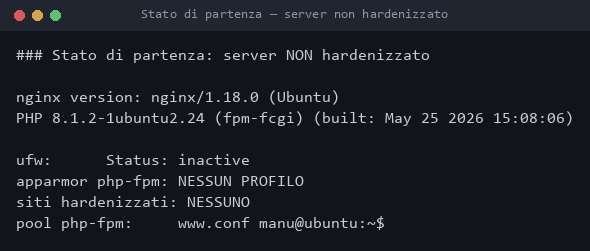

Il repository si copia sul server con un semplice `tar` over SSH:

```bash
tar czf - scripts templates config sites tools | \
  ssh utente@SERVER 'rm -rf ~/hardening && mkdir -p ~/hardening && \
    tar xzf - -C ~/hardening && chmod +x ~/hardening/scripts/*.sh'
```

---

## Cap. 1 — Il menu (`harden-menu.sh`)

Tutto passa da un unico orchestratore testuale (whiptail). Si avvia con:

```bash
sudo bash ~/hardening/scripts/harden-menu.sh
```

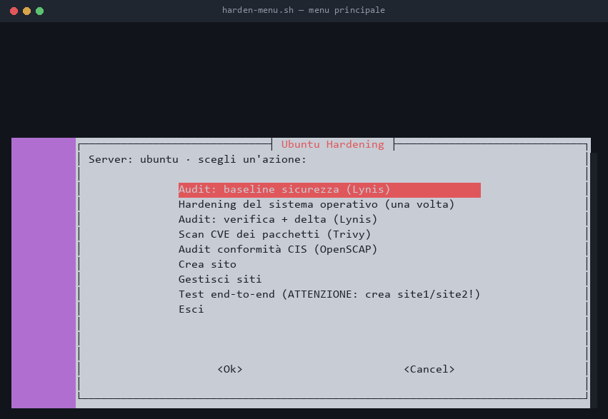

Il menu principale tiene le operazioni **globali** (audit e hardening OS, una
tantum) e le due voci per i siti: **Crea sito** e **Gestisci siti**.

---

## Cap. 2 — Misura di base (Lynis baseline)

Prima di toccare nulla, misuriamo la postura di sicurezza con Lynis (voce *Audit:
baseline sicurezza*). Serve come termine di paragone "prima/dopo".

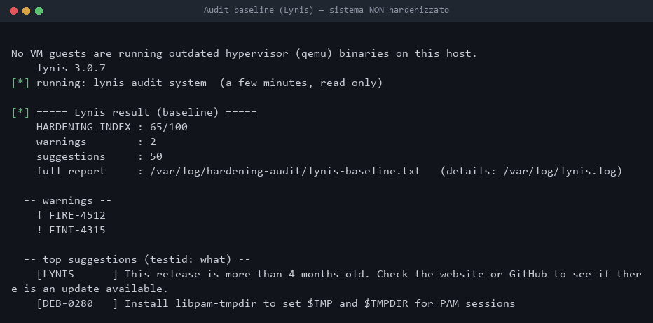

**Hardening index di partenza: 65/100.** Ce lo ricorderemo alla fine.

---

## Cap. 3 — Hardening del sistema operativo

La voce *Hardening del sistema operativo* applica il layer condiviso (una volta
per server). Chiede solo **3 parametri**, con default sicuri:

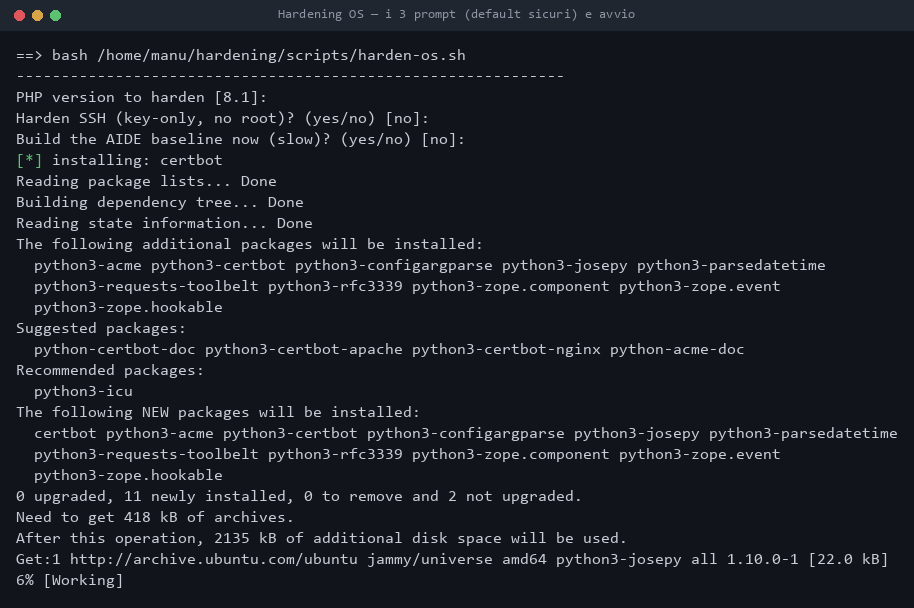

- **PHP 8.1** — la versione da hardenizzare;
- **SSH hardening = no** — di proposito all'inizio, per non rischiare il lockout
  finché non si è confermato l'accesso con chiave;
- **AIDE baseline = no** — la si costruisce dopo (è lenta).

Al termine (~2 minuti) sono attivi: **UFW default-deny + egress**, **profilo
AppArmor master**, **auditd**, **fail2ban**, **unattended-upgrades**, sysctl,
login.defs, e — installato dallo script — **YARA-X (`yr`)** per la scansione
malware.

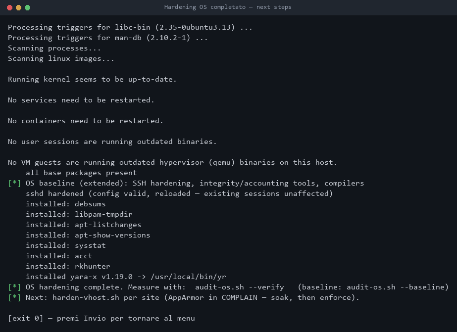

```text
$ yr --version            → yara-x-cli 1.19.0
$ sudo ufw status         → Status: active
$ ls /etc/apparmor.d/php-fpm  → profile loaded
$ systemctl is-active auditd fail2ban  → active / active
```

---

## Cap. 4 — Creare un sito

La voce *Crea sito* chiede prima il **nome breve** (usato per utente, pool e hat):

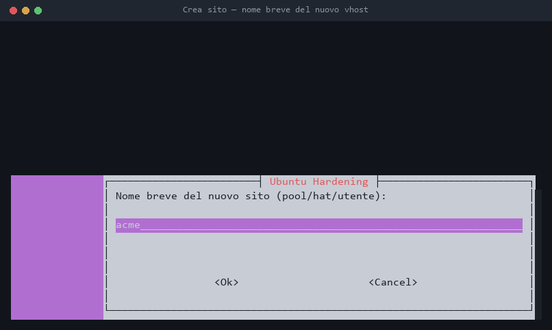

Poi presenta una **maschera a gruppi**: si personalizza per area, quindi si lancia
la creazione.

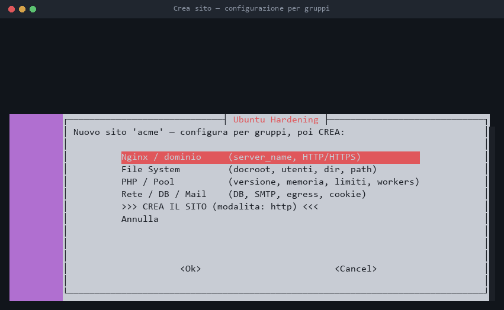

Ogni gruppo mostra i campi con il **valore attuale già compilato** (default
derivati dal nome del sito). Ad esempio il gruppo **File System**:

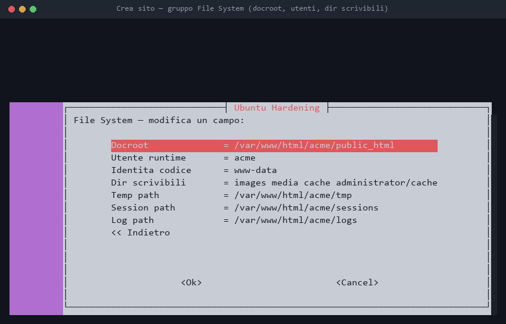

Un riepilogo finale chiede conferma:

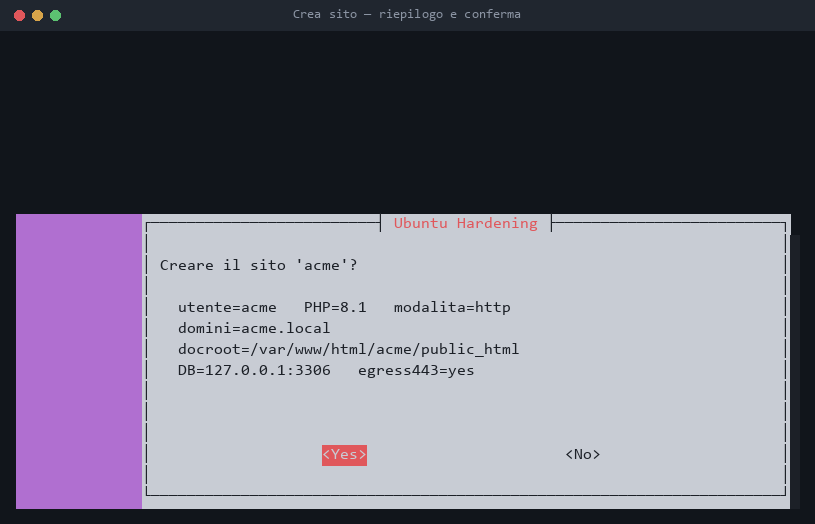

Alla conferma, `harden-vhost.sh` crea utente, pool, hat, server block nginx,
catena egress e stato policy. Il sito nasce in AppArmor **complain** (rodaggio).

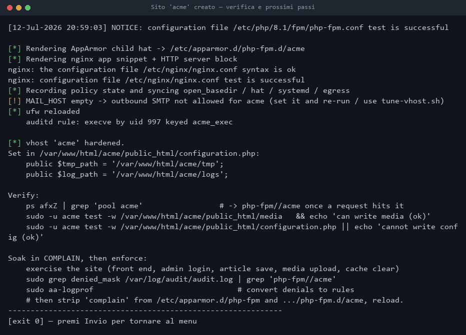

Cosa è stato creato:

```text
pool:   acme.conf   (www.conf disabilitato → niente pool generico)
hat:    php-fpm.d/acme
nginx:  sites-enabled/acme
utente: uid=997(acme)
stato:  /etc/hardening/sites/acme/  (meta, reach-*.paths, egress-*.allow, answers.env)
```

---

## Cap. 5 — Modificare un sito (day-2)

Scenario realistico: l'applicazione richiede una **nuova cartella di upload**
(`public_html/uploads`) non prevista alla creazione. La gestiamo dal menu
**Gestisci siti**, che raccoglie tutte le operazioni per-sito:

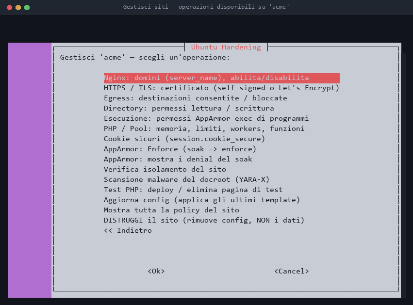

### 5.1 — Aggiungere un path scrivibile (grant-write)

La schermata **Directory** mostra sempre lo **stato attuale**: cartelle
scrivibili e in sola lettura con permessi e proprietari reali.

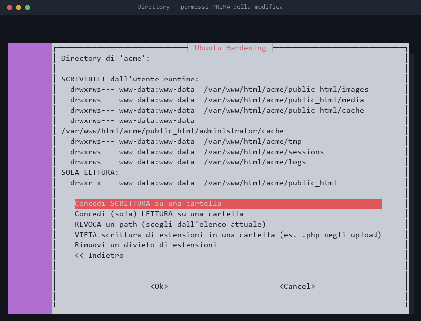

Concedendo la scrittura si sceglie **da un elenco** (niente digitazione alla
cieca): il menu propone le sottocartelle del docroot non ancora concesse — fra
cui la nuova `uploads`.

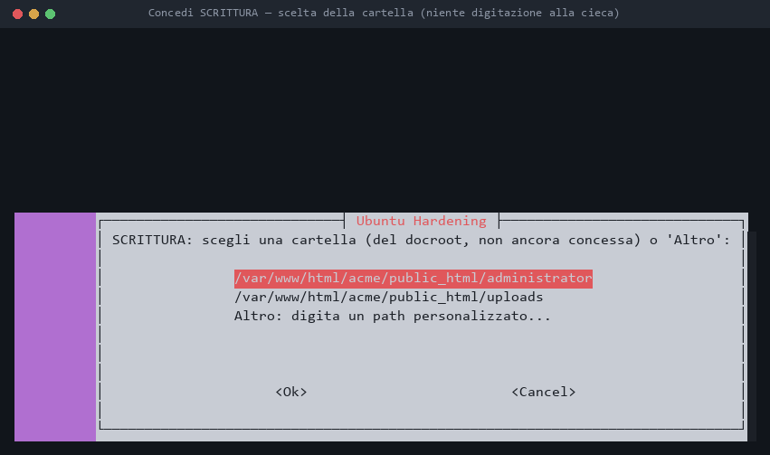

Ogni modifica passa da `tune-vhost` con **anteprima dry-run** se rispondi *No*:

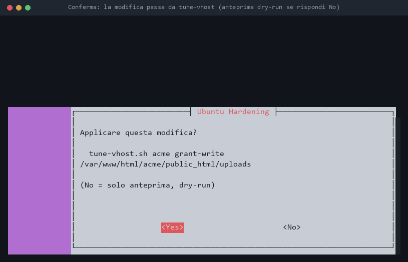

Un solo comando aggiorna **tutti i punti coordinati** — `open_basedir` del pool,
l'hat AppArmor, `ReadWritePaths` di systemd e (se sotto il docroot) il deny PHP di
nginx — e riavvia php-fpm quando serve:

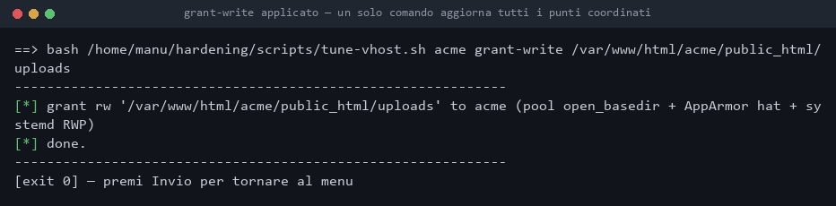

La Directory ora mostra `uploads` fra le cartelle scrivibili (**stato
aggiornato**, non serve ricordarselo):

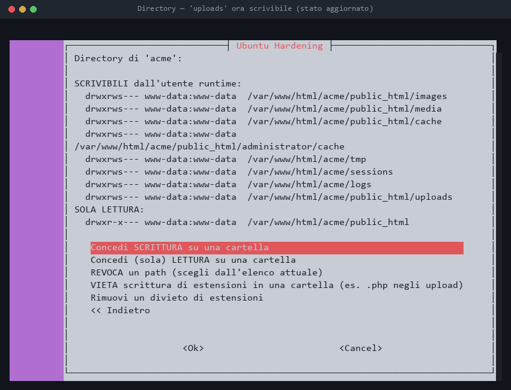

### 5.2 — Vietare `.php` nella cartella di upload (deny AppArmor granulare)

`uploads` è una cartella di *puro upload*: l'app non ci scrive mai PHP legittimo.
La irrigidiamo vietando la **scrittura** di estensioni pericolose (voce *VIETA
scrittura di estensioni*). Il menu propone un set di default:

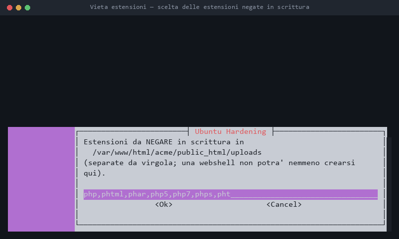

Applicato, il divieto compare nel riepilogo della Directory come **DIVIETI
ESTENSIONI**:

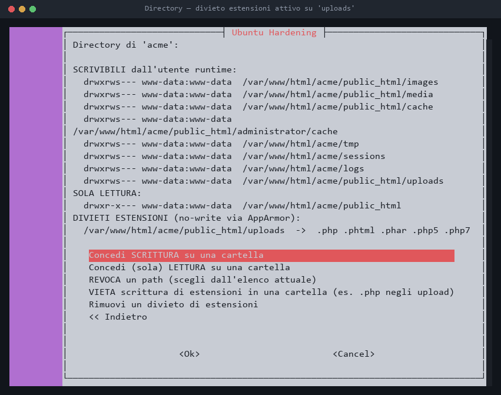

Nell'hat vengono generate regole `deny` **case-insensitive** che coprono anche il
`rename` verso `.php`:

```text
deny /var/www/html/acme/public_html/uploads/**.[pP][hH][pP] w,
deny /var/www/html/acme/public_html/uploads/**.[pP][hH][tT][mM][lL] w,
deny /var/www/html/acme/public_html/uploads/**.[pP][hH][aA][rR] w,
...
```

> **Granularità voluta**: alcune app scrivono `.php` legittimi in *certe* cartelle
> scrivibili (Joomla salva `logs/error.php`, la compilazione dei template scrive
> in `cache/`). Per questo il divieto si applica **solo** alle cartelle indicate,
> mai a `logs/` o `cache/`.

### 5.3 — Aprire una destinazione egress

La schermata **Egress** mostra le destinazioni consentite in uscita per l'uid del
sito; tutto il resto è **REJECT**.

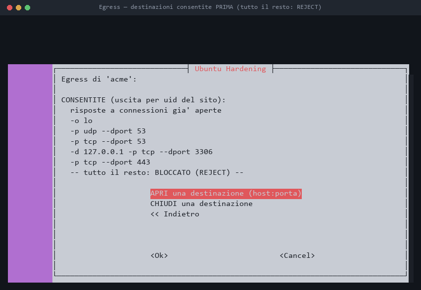

Apriamo il relay SMTP (`10.0.0.20:587`) per l'invio mail dell'app:

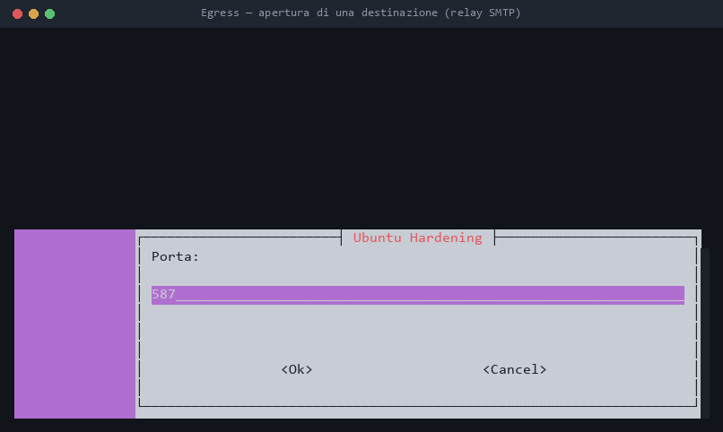

La regola viene aggiunta alla catena `acme_EGRESS` (in `before.rules` +
`before6.rules`) e ufw ricaricato:

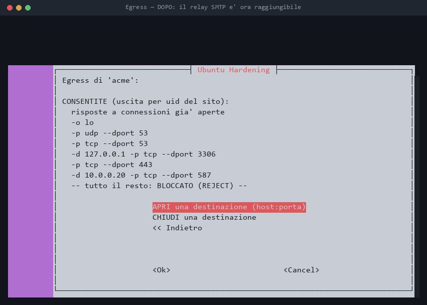

---

## Cap. 6 — Test PHP e vettore webshell

Il menu ha un sotto-menu **Test PHP** per installare/rimuovere la pagina
diagnostica `hardening-check.php`:

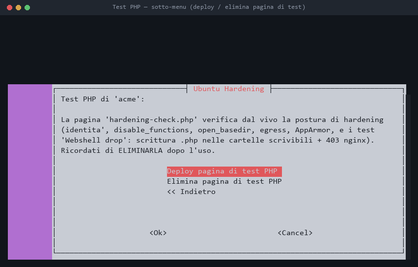

Il **Deploy** installa due file: la pagina nel docroot **e** una probe `.php` in
una cartella scrivibile (`images/`). La probe **deve** dare **403** — lo script lo
verifica da solo:

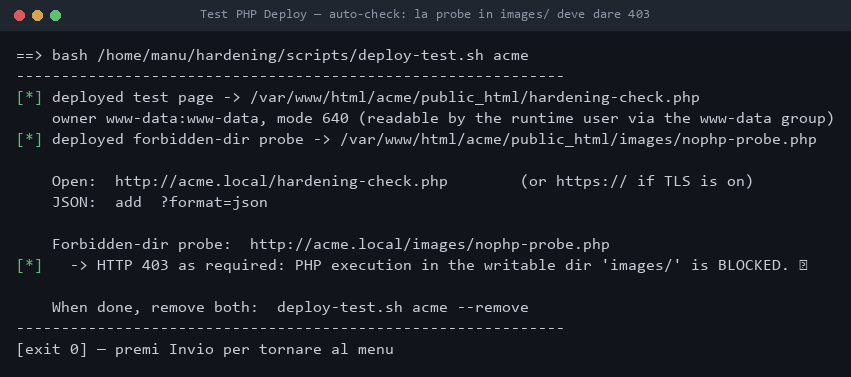

La pagina, aperta con `?format=json`, include il gruppo **Webshell drop**: per
ogni cartella scrivibile prova a creare un `.php` e, se è servita dal web, fa un
**self-request in loopback** per vedere cosa risponde nginx. Ecco l'esito reale
sul sito `acme`:

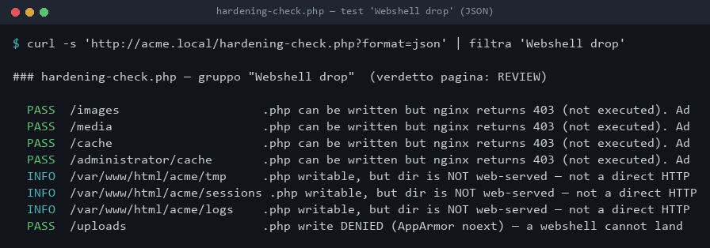

Si leggono **entrambi** i controlli: le cartelle CMS (`images/media/cache`)
lasciano scrivere il `.php` ma **nginx risponde 403** (non eseguito); la cartella
`uploads` — dove abbiamo messo il divieto — dà **`.php write DENIED (AppArmor
noext)`**: la webshell non riesce nemmeno ad atterrare su disco.

---

## Cap. 7 — Da complain a enforce

Regola d'oro: **complain → soak → enforce**. La voce *AppArmor: Enforce* controlla
prima che l'hat conceda i permessi minimi dichiarati, poi chiede conferma:

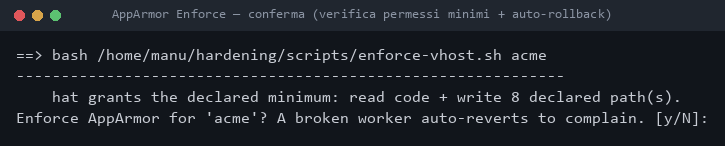

Lo script mette l'hat in enforce, riavvia php-fpm, fa un **health-check** e — se il
worker si rompesse — **torna automaticamente a complain**. Qui il worker risponde,
quindi l'enforce regge:

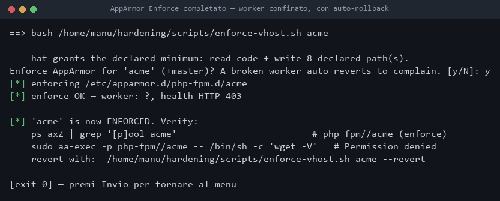

Il worker gira ora confinato come `php-fpm//acme (enforce)`: **non può eseguire
alcun binario esterno**.

---

## Cap. 8 — Prova d'isolamento

La voce *Verifica isolamento* deploya una sonda, la richiama via nginx e verifica
che ogni tentativo di evasione sia negato:

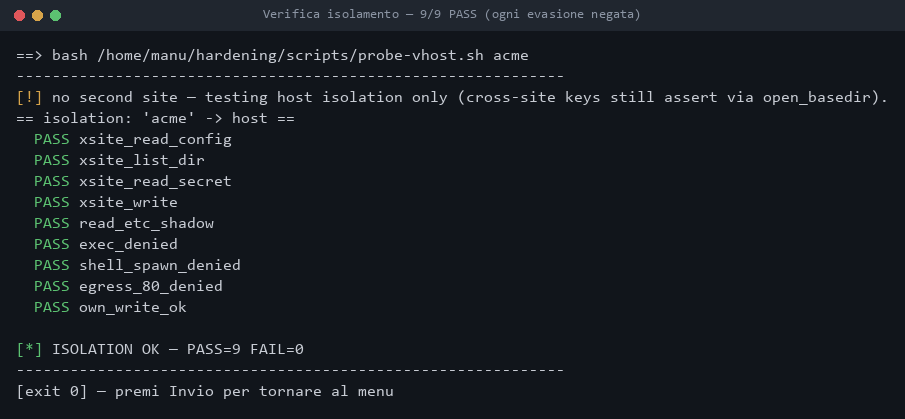

**9/9 PASS**: lettura/scrittura verso altri percorsi, lettura di `/etc/shadow`,
exec di binari, apertura di una shell, uscita di rete su `:80` — **tutte negate** —
mentre la scrittura nella propria cartella funziona (`own_write_ok`).

---

## Cap. 9 — Scansione malware (YARA-X)

La voce *Scansione malware* passa il docroot con `yr` e le regole webshell:

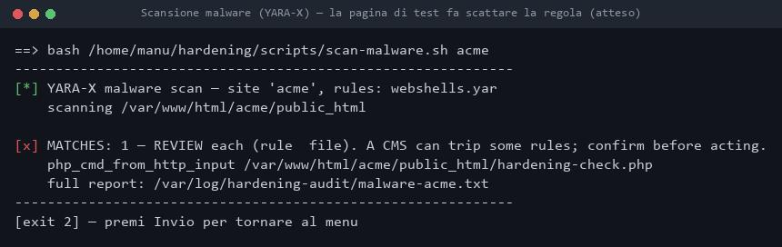

Nell'esempio segnala `hardening-check.php`: è la **pagina di test** che contiene
`system()` alimentato da input HTTP (di proposito, per testare `disable_functions`)
— un vero positivo **atteso**. Dimostra che lo scanner intercetta il pattern
"comando da input HTTP". La pagina va rimossa dopo l'uso (*Test PHP → Elimina*).

---

## Cap. 10 — Policy completa del sito

La voce *Mostra tutta la policy* dà il quadro unico di ciò che abbiamo costruito e
modificato:

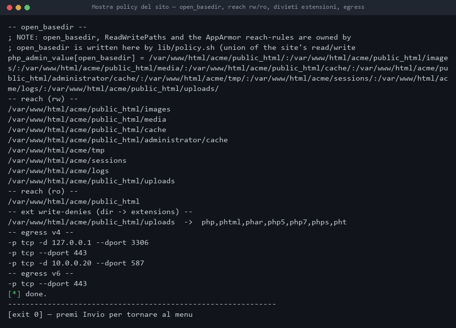

Si vedono in un colpo solo: `open_basedir` (con `uploads/`), le cartelle **reach**
rw/ro, i **divieti estensioni** su `uploads`, e l'**egress v4/v6** — DB `3306`,
HTTPS `443`, e il relay `587` aggiunto al Cap. 5.3.

---

## Cap. 11 — Misura finale (Lynis 65 → 83)

Chiudiamo rimisurando con la voce *Audit: verifica + delta*:

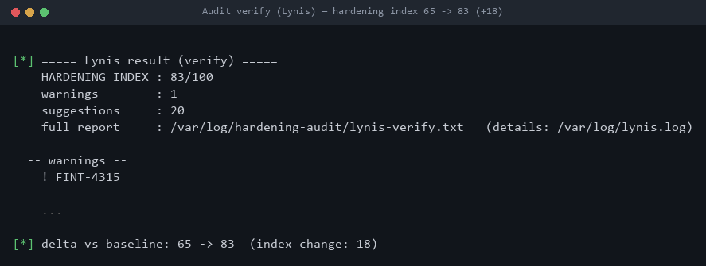

**Hardening index: 65 → 83 (+18)** sul solo layer OS, misurato con uno strumento
standard indipendente. (Gli altri assi — CVE con Trivy, compliance CIS con
OpenSCAP — hanno le loro voci di menu dedicate.)

---

## Riepilogo

Partendo da una Ubuntu 22.04 pulita, con il solo menu abbiamo:

| Passo | Risultato |
|---|---|
| Baseline Lynis | index **65** |
| Hardening OS | UFW default-deny + egress, AppArmor master, auditd, fail2ban, unattended-upgrades, **YARA-X** |
| Sito `acme` | uid dedicato, pool `php_admin_*`, hat no-exec, nginx, egress per-uid, modello permessi `web_user` |
| Modifica day-2 | +path scrivibile `uploads` (sync su 4 file), **divieto `.php`** granulare su `uploads`, +egress SMTP `587` |
| Test PHP | probe in `images/` → **403**; gruppo *Webshell drop* → tutto PASS/INFO |
| Enforce | worker `php-fpm//acme (enforce)`, con auto-rollback |
| Isolamento | **9/9 PASS** |
| Malware | YARA-X operativo (match atteso sulla pagina di test) |
| Verifica finale | Lynis **65 → 83 (+18)** |

Il raggio d'impatto orizzontale è contenuto su più livelli indipendenti: nessuno
di essi è considerato sufficiente da solo. Per il razionale completo vedi
[`GUIDA.md`](GUIDA.md) e [`apache-php-hardening-runbook.md`](apache-php-hardening-runbook.md).

---

*Screenshot: catture reali del terminale (Ubuntu 22.04, VM di test), output ANSI
renderizzato in PNG.*
